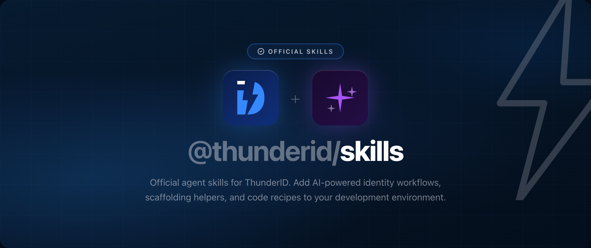

Official ThunderID skill repository for AI coding agents. This workspace contains ThunderID agent skills to help install the server, configure providers, and wire authentication into applications.

## Repository structure

```text
skills/
  core/
    setup-thunderid/        Install and start the ThunderID server
  integration/
    integrate-nextjs/       @thunderid/nextjs
    integrate-nuxt/         @thunderid/nuxt
    integrate-react/        @thunderid/react
    integrate-react-router/ @thunderid/react + @thunderid/react-router
    integrate-tanstack-router/ @thunderid/react + @thunderid/tanstack-router
    integrate-vue/          @thunderid/vue
    integrate-express/      @thunderid/express
    integrate-node/         @thunderid/node
    integrate-browser/      @thunderid/browser
    integrate-javascript/   @thunderid/javascript
    integrate-oidc/         Generic OIDC (Angular, Svelte, Python, Go, etc.)
```

## Usage

### Agent Skills CLI

```bash
npx skills add thunderid/skills
```

### Codex CLI

```bash
codex plugin marketplace add thunderid/skills
```

Restart Codex, go to `/plugins`, and enable the ThunderID plugin.

### Claude Code (manual)

```bash
git clone https://github.com/thunderid/skills ~/.claude/skills/thunderid
```

Then add to your project's `CLAUDE.md`:

```md
@~/.claude/skills/thunderid/skills/core/setup-thunderid/SKILL.md
@~/.claude/skills/thunderid/skills/integration/integrate-react/SKILL.md
```

## Example prompts

- "Set up ThunderID on my machine"
- "Add ThunderID auth to my Next.js app"
- "Integrate ThunderID into my Vue project"
- "Protect routes in my Express app with ThunderID"
- "Add ThunderID to my Angular app"

## License

Apache 2.0
